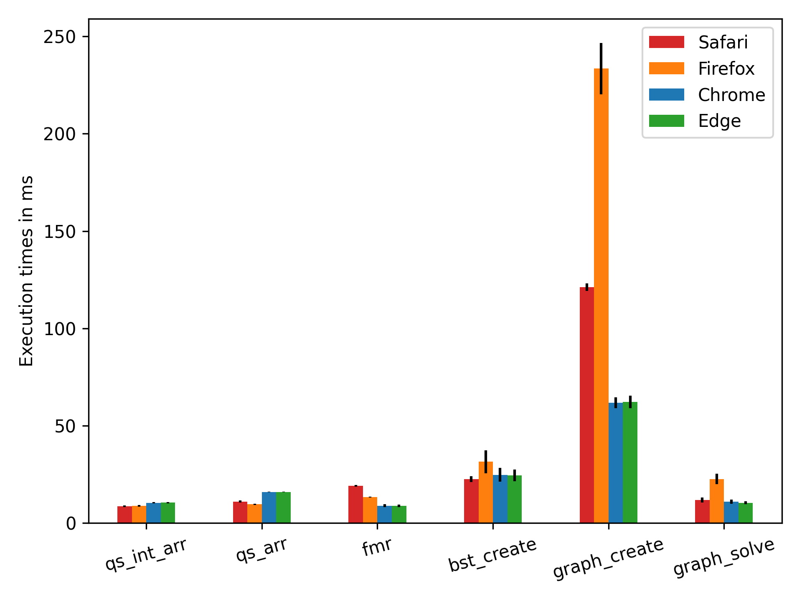

# WebAssembly Performance

evaluating webassembly vs javascript performance within a vue.js application.  

* [benchmarking setup](#benchmarking-setup)
* [benchmarking results](#research-questions--results)
* [development setup](#development-setup)

## Benchmarking Setup

| factor    | levels                                                                                                        |
| --------- | ------------------------------------------------------------------------------------------------------------- |
| language  | javascript, webassembly                                                                                       |
| device    | desktop, laptop, smartphone                                                                                   |
| browser   | chrome, firefox, edge, safari, samsung                                                                        |
| algorithm | quicksort (qs), filter-map-reduce (fmr), binary search tree (bst) create, maze create (prim), maze solve (a*) |

### Algorithm Experiment Setup

| algorithm   | factors    | levels                        | response variable | replication |
| ----------- | ---------- | ----------------------------- | ----------------- | ----------- |
| qs          | input size | 10<sup>1</sup>-10<sup>6</sup> | time in ms        | 30          |
|             | input type | arraybuffer, array/vec        | time in ms        | 30          |
| fmr         | input size | 10<sup>1</sup>-10<sup>6</sup> | time in ms        | 30          |
|             | input size | arraybuffer, jsvalue          | time in ms        | 30          |
| bst         | input size | 10<sup>1</sup>-10<sup>6</sup> | time in ms        | 30          |
| maze create | maze size  | 10, 50-300 (50 step)          | time in ms        | 30          |
| maze solve  | maze size  | 10, 50-300 (50 step)          | time in ms        | 30          |

### Device Hardware Specifications

| device      | cpu                 |  ram | os                  | browsers<sup>1</sup> |
| ----------- | ------------------- | ---: | ------------------- | -------------------- |
| desktop     | amd ryzen 7 3700x   | 32gb | linux 5.9.1-arch1-1 | c, f, e              |
| macbook pro | intel core i5-8257u | 16gb | macos 10.15.7       | c, f, e, s           |
| iphone 7    | a10 4x2.34ghz       |  2gb | ios 14.1            | s                    |
| galaxy s5   | qalcomm 4x2.25ghz   |  2gb | android 6.0.1       | c, f, sam            |

<sup>1</sup> <sub>c=chrome 86, f=firefox 82, e=edge 86, s=safari 14, sam=samsung 12</sub>

## Research Questions & Results

1. what  is  the  performance  difference  between  javascript  and  webassembly across different browsers?
2. how large is the execution time distribution for javascript and webassembly per function across different browsers?
3. how does the performance change for increasing payloads for webassembly and javascript?
4. how large is the introduced overhead for copy and/or serialization operationsand to what extend is this influenced by input size?

graphs shown are mostly for macbook, 10<sup>5</sup> array and 150x150 mazes</sub>

### RQ1: Speedup of WebAssembly over JavaScript

#### JavaScript Performance



#### WebAssembly Performance


#### Speedup WebAssembly over JavaScript


#### Overall Overview Speedup WebAssembly

| device     | type    | safari | firefox | chrome | edge | samsung |
| ---------- | ------- | -----: | ------: | -----: | ---: | ------: |
| desktop    | geomean |      - |    1.38 |   0.40 | 0.39 |       - |
|            | median  |      - |    1.12 |   0.35 | 0.35 |       - |
| macbook    | geomean |   1.09 |    1.38 |   0.67 | 0.65 |       - |
|            | median  |  1.1.3 |    1.15 |   0.66 | 0.66 |       - |
| smartphone | geomean |   0.72 |    1.00 |   0.33 |    - |    0.37 |
|            | median  |   0.89 |    1.07 |   0.17 |    - |    0.18 |

### RQ2: Distribution of Execution Times

#### Distribution of Execution Times for JavaScript


#### Distribution of Execution Times for WebAssembly


#### Standard Deviation for JavaScript and WebAssembly

| benchmark   | language | safari | firefox | chrome |
| ----------- | -------- | -----: | ------: | -----: |
| qs          | js       |   0.47 |    0.38 |   0.26 |
|             | wasm     |   0.53 |    0.11 |   0.18 |
| fmr         | js       |   0.44 |    0.20 |   0.76 |
|             | wasm     |   0.47 |    0.07 |   0.22 |
| bst_create  | js       |   1.47 |    5.96 |   3.56 |
|             | wasm     |  11.62 |    0.66 |   1.86 |
| maze_create | js       |   1.89 |   13.20 |   2.85 |
|             | wasm     |   1.24 |    1.57 |   2.36 |
| mze_solve   | js       |   1.33 |    2.69 |   1.09 |
|             | wasm     |   0.97 |    8.76 |  14.13 |

### RQ3: Performance Change for Increasing Payloads

#### fmr


#### fmr, log-scale


### RQ4: Copy and Serialization Overhead

#### Percentage Difference for Copy/Serialize Variant for fmr

| size           |  safari | firefox |  chrome |
| -------------- | ------: | ------: | ------: |
| 10<sup>1</sup> |     inf | 233.33% | 187.91% |
| 10<sup>2</sup> | 300.00% | 505.88% | 704.67% |
| 10<sup>3</sup> | 350.00% | 309.17% | 152.72% |
| 10<sup>4</sup> | 288.24% | 296.26% | 355.23% |
| 10<sup>5</sup> | 284.62% | 890.13% | 303.37% |
| 10<sup>6</sup> | 280.29% | 830.08% | 323.72% |

### Size Comparison

| target               | normal |  gzip | brotli |
| -------------------- | -----: | ----: | -----: |
| js                   |   4.9K |  2.0K |   1.8K |
| wasm-std             | 145.0K | 56.0K |  47.0K |
| wasm-ol_s            | 135.0K | 53.0K |  44.0K |
| wasm-ol_z            | 137.0K | 53.0K |  45.0K |
| wasm-ol_z-opt_Oz     | 137.0K | 53.0K |  45.0K |
| wasm-all<sup>2</sup> | 124.0K | 43.0K |  36.0K |
| js glue              |   6.9K |  2.6K |   2.3K |

<sup>2</sup> ["-ol", "2", "-s", "s", "--duplicate-function-elimination", "--inlining-optimizing", "--remove-unused-module-elements", "--memory-packing", "--remove-memory"]

## Development Setup

* [node.js](https://howtonode.org/how-to-install-nodejs)
* [rust](https://www.rust-lang.org/tools/install)
* [wasm-pack](https://rustwasm.github.io/wasm-pack/installer)
* [python3](https://www.python.org/downloads)
* [mongodb](https://www.mongodb.com)

### Structure

* ./node-server     = node server, also contains utility function for data creation
* ./python-analysis = python project to analyse and visualize the result data
* ./rust-lib        = rust library
* ./vue-app         = vue.js web application

### Branches

* `smartphone` contains the adjusted benchmark data with reduced sizes

### Install Dependencies

```bash
# install dependencies for vue-app
cd vue-app && npm i

# install dependencies for node-server
cd node-server && npm i

# install dependencies for python analysis
cd python-analysis

## create venv
python -m venv venv

## activate venv
source ./venv/bin/activate # unix
.\venv\Scripts\activate.bat # windows

## install dependencies 
pip install -r requirements.txt
```

### Build

```bash
# vue-app
cd vue-app && npm run build
## this builds the vue application to ./node-server/public
## this also automatically installs all necessary crates and
## builds the rust-lib as wasm-pkg
## the branch `smartphone` contains the fixed tests for smartphones
```

### Run

```bash
# node-server
cd node-server && npm run start
## server starts on port 8081

# python-analysis
## requires mongodb to be installed
cd python-analysis/src
python __main__.py

## this should automatically start mongodb and connect
## the connection details are set for the default installation
## if necessary change the mongodb installation path
## and/or the database path accordingly in the start method of:
## ./python-analysis/src/data_base/mongo.py
```

### Tests

```bash
# vue-app
cd vue-app && npm run test:unit

# rust-lib
cd rust-lib && cargo test && wasm-pack test --node
```

### Notes

* the vue-app contains visualizations of the generated mazes and the found solution -> links on the start page
* running the vue-app in developer mode does not work for multiple workers -> build & run from node-server (as described above)
* the python code is not refactored and does not follow good coding standards (minor code duplications)
